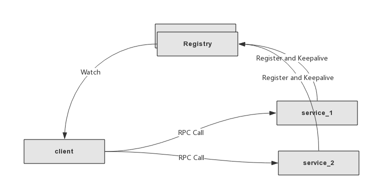

## go基于grpc构建微服务框架-服务注册与发现

### 概述


grpc 是谷歌开源的rpc框架,基于http2实现,并支持跨语言,目前基本涵盖了主流语言.跨语言的实现主要得益于protobuf,通过编写proto文件,通过protobuf工具生成对应语言的类库进行使用.


对于go这样一门新生语言来说,生态链还处于发展阶段,微服务框架也是如此,下面将基于grpc-go版本搭建一个微服务通讯框架.

### 1.服务注册与发布的机制


#### 1.1 解决的问题

服务注册与发布主要解决的服务依赖问题,通常意义上,如果A服务调用B服务时,最直接的做法是配置IP地址和端口.但随着服务依赖变多时,配置将会是否庞杂,且当服务发生迁移时,那么所有相关服务的配置均需要修改,这将十分难以维护以及容易出现问题.
因此为了解决这种服务依赖关系,服务注册与发布应运而生.

#### 1.2 机制

服务注册与发现主要分为以下几点.

* 服务信息发布
这里主要是服务的服务名,IP信息,以及一些附件元数据.通过注册接口注册到服务注册发布中心.
* 存活检测
当服务意外停止时,客户端需要感知到服务停止,并将服务的IP地址踢出可用的IP地址列表,这里可以使用定时心跳去实现.
* 客户端负载均衡
通过服务注册与发布,可以实现一个服务部署多台实例,客户端实现在实例直接的负载均衡,从而实现服务的横向扩展.

因此,服务注册与发布可以概况为,服务将信息上报,客户端拉取服务信息,通过服务名进行调用,当服务宕机时客户端踢掉故障服务,服务新上线时客户端自动添加到调用列表.
### 2.实现

grpc-go的整个实现大量使用go的接口特性,因此通过扩展接口,可以很容易的实现服务的注册与发现,这里服务注册中心考虑到可用性以及一致性,一般采用etcd或zookeeper来实现,这里实现etcd的版本.


#### 2.1 客户端
具体需要实现几个接口,针对客户端,最简单的实现方式只需要实现两个接口方法Resolve(),以及Next(),然后使用轮询的负载均衡方式.
主要通过etcd的Get接口以及Watch接口实现.
* Resolve()接口
```
//用于生成Watcher,监听注册中心中的服务信息变化
func (er *etcdRegistry) Resolve(target string) (naming.Watcher, error) {
	ctx, cancel := context.WithTimeout(context.TODO(), resolverTimeOut)
	w := &etcdWatcher{
		cli:    er.cli,
		target: target + "/",
		ctx:    ctx,
		cancel: cancel,
	}
	return w, nil
}

```


* Next() 接口

```
//Next接口主要用于获取注册的服务信息,通过channel以及watch,当服务信息发生
//变化时,Next接口会将变化返回给grpc框架从而实现服务信息变更.
func (ew *etcdWatcher) Next() ([]*naming.Update, error) {
	var updates []*naming.Update
    //初次获取时,创建监听channel,并返回获取到的服务信息
	if ew.watchChan == nil {
		//create new chan
		resp, err := ew.cli.Get(ew.ctx, ew.target, etcd.WithPrefix(), etcd.WithSerializable())
		if err != nil {
			return nil, err
		}
		for _, kv := range resp.Kvs {
			var upt naming.Update
			if err := json.Unmarshal(kv.Value, &upt); err != nil {
				continue
			}
			updates = append(updates, &upt)
		}
        //创建etcd的watcher监听target(服务名)的信息.
		opts := []etcd.OpOption{etcd.WithRev(resp.Header.Revision + 1), etcd.WithPrefix(), etcd.WithPrevKV()}
		ew.watchChan = ew.cli.Watch(context.TODO(), ew.target, opts...)
		return updates, nil
	}

    //阻塞监听,服务发生变化时才返回给上层
	wrsp, ok := <-ew.watchChan
	if !ok {
		err := status.Error(codes.Unavailable, "etcd watch closed")
		return nil, err
	}
	if wrsp.Err() != nil {
		return nil, wrsp.Err()
	}
	for _, e := range wrsp.Events {
		var upt naming.Update
		var err error
		switch e.Type {
		case etcd.EventTypePut:
			err = json.Unmarshal(e.Kv.Value, &upt)
			upt.Op = naming.Add
		case etcd.EventTypeDelete:
			err = json.Unmarshal(e.PrevKv.Value, &upt)
			upt.Op = naming.Delete
		}

		if err != nil {
			continue
		}
		updates = append(updates, &upt)
	}
	return updates, nil
}

```

#### 2.2 服务端

服务端只需要上报服务信息,并定时保持心跳,这里通过etcd的Put接口以及KeepAlive接口实现.
具体如下:

```
func (er *etcdRegistry) Register(ctx context.Context, target string, update naming.Update, opts ...wrapper.RegistryOptions) (err error) {
	//将服务信息序列化成json格式
    var upBytes []byte
	if upBytes, err = json.Marshal(update); err != nil {
		return status.Error(codes.InvalidArgument, err.Error())
	}

	ctx, cancel := context.WithTimeout(context.TODO(), resolverTimeOut)
	er.cancal = cancel
	rgOpt := wrapper.RegistryOption{TTL: wrapper.DefaultRegInfTTL}
	for _, opt := range opts {
		opt(&rgOpt)
	}

	switch update.Op {
	case naming.Add:
		lsRsp, err := er.lsCli.Grant(ctx, int64(rgOpt.TTL/time.Second))
		if err != nil {
			return err
		}

        //Put服务信息到etcd,并设置key的值TTL,通过后面的KeepAlive接口
        //对TTL进行续期,超过TTL的时间未收到续期请求,则说明服务可能挂了,从而清除服务信息
		etcdOpts := []etcd.OpOption{etcd.WithLease(lsRsp.ID)}
		key := target + "/" + update.Addr
		_, err = er.cli.KV.Put(ctx, key, string(upBytes), etcdOpts...)
		if err != nil {
			return err
		}

        //保持心跳
		lsRspChan, err := er.lsCli.KeepAlive(context.TODO(), lsRsp.ID)
		if err != nil {
			return err
		}
		go func() {
			for {
				_, ok := <-lsRspChan
				if !ok {
					grpclog.Fatalf("%v keepalive channel is closing", key)
					break
				}
			}
		}()
	case naming.Delete:
		_, err = er.cli.Delete(ctx, target+"/"+update.Addr)
	default:
		return status.Error(codes.InvalidArgument, "unsupported op")
	}
	return nil
}
```

### 3. 参考
https://grpc.io/
https://coreos.com/etcd/


