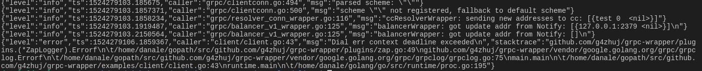

### 1.结构化日志的意义

#### 1.1 日志格式化
日志主要用于跟踪服务的运行信息,作为后端攻城狮,一般都会有一种想法,平时的时候希望日志越少越好,出问题的时候又总是抱怨,怎么才tmd这点日志,还在关键的地方没打印.

因此,日志很重要,将日志进行格式化也很重要,日志格式化主要是为了方便后续进行分析.如通过将错误码格式化到日志中,我们可以对收集后的日志分析接口的调用健康状态,将接口耗时格式化后上报,可以监控延时高的操作,并查询出关联日志进行分析.

所以只要是格式化输出,很容易有很多应用.

#### 1.2 日志库应该有的特性
* 高性能</br>
这里主要是两方面，每次操作的耗时，以及每次操作分配的内存，作为日志库，两个指标都应该要极低．

* 日志等级过滤</br>
能通过调节日志等级打印不同级别的日志．

* 采样率</br>
能够设置采样率，防止服务请求增加时输出的日志量剧增，从而影响服务性能．


* 自动切分文件</br>
自动按一定大小切分文件，定期归档，保存一定数量文件．


基于以上几点，选择uber开源的日志库 [zap](https://github.com/uber-go/zap).


### 2.集成到grpc中

#### 2.1 思路
grpc 定义了grpclog包，并定义了LoggerV2的接口，因此，只要通过zap实现LoggerV2的接口，并通过SetLoggerV2(l LoggerV2)接口将实现的对象设置到grpclog包中，那么grpc将使用zap进行日志输出，同时上层应用也可以使用grpclog进行业务日志打印．

#### 2.2 实现
完整代码以及使用示例见 [grpc-wrapper](https://github.com/g4zhuj/grpc-wrapper)

```
type ZapLogger struct {
	logger *zap.Logger
}

//创建封装了zap的对象，该对象是对LoggerV2接口的实现
func NewZapLogger(logger *zap.Logger) *ZapLogger {
	return &ZapLogger{
		logger: logger,
	}
}
func (zl *ZapLogger) Info(args ...interface{}) {
	zl.logger.Sugar().Info(args...)
}

func (zl *ZapLogger) Infoln(args ...interface{}) {
	zl.logger.Sugar().Info(args...)
}
func (zl *ZapLogger) Infof(format string, args ...interface{}) {
	zl.logger.Sugar().Infof(format, args...)
}

func (zl *ZapLogger) Warning(args ...interface{}) {
	zl.logger.Sugar().Warn(args...)
}

func (zl *ZapLogger) Warningln(args ...interface{}) {
	zl.logger.Sugar().Warn(args...)
}

func (zl *ZapLogger) Warningf(format string, args ...interface{}) {
	zl.logger.Sugar().Warnf(format, args...)
}

func (zl *ZapLogger) Error(args ...interface{}) {
	zl.logger.Sugar().Error(args...)
}

func (zl *ZapLogger) Errorln(args ...interface{}) {
	zl.logger.Sugar().Error(args...)
}

func (zl *ZapLogger) Errorf(format string, args ...interface{}) {
	zl.logger.Sugar().Errorf(format, args...)
}

func (zl *ZapLogger) Fatal(args ...interface{}) {
	zl.logger.Sugar().Fatal(args...)
}

func (zl *ZapLogger) Fatalln(args ...interface{}) {
	zl.logger.Sugar().Fatal(args...)
}

// Fatalf logs to fatal level
func (zl *ZapLogger) Fatalf(format string, args ...interface{}) {
	zl.logger.Sugar().Fatalf(format, args...)
}

// V reports whether verbosity level l is at least the requested verbose level.
func (zl *ZapLogger) V(v int) bool {
	return false
}

```


### 3.最终效果



可以看到，日志以json格式输出，并显示了日志打印时的代码行数，同时当出现error时进行了调用栈的追踪．

### 参考
https://github.com/uber-go/zap


