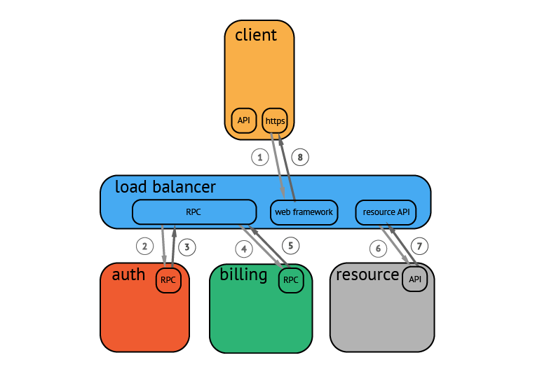
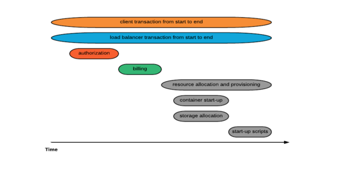
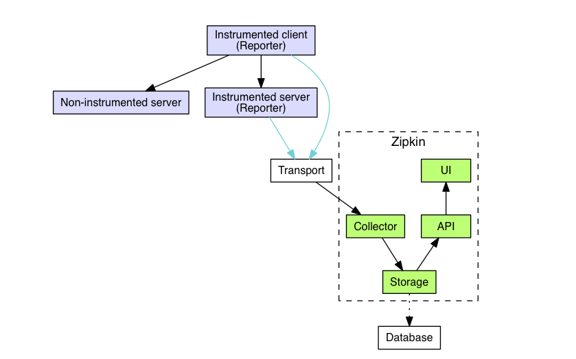
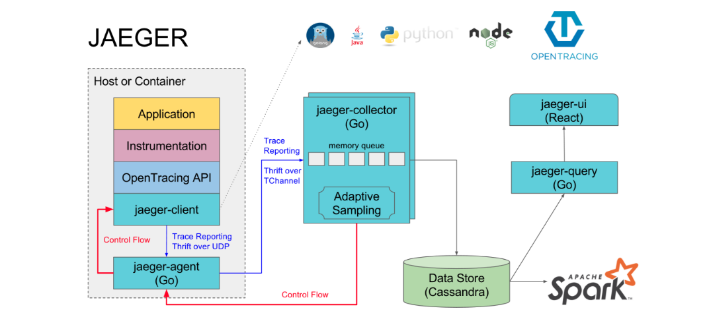
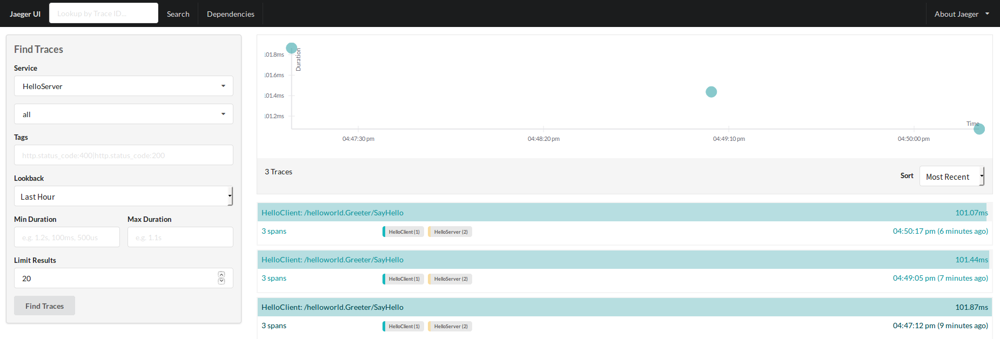

### grpc集成opentracing

### 1.概述
存在这样一种场景，当我们进行微服务拆分后，一个请求将会经过多个服务处理之后再返回，这时，如果在请求的链路上某个服务出现故障时，排查故障将会比较困难．
我们可能需要将请求经过的服务，挨个查看日志进行分析，当服务有几十上百个实例时，这无疑是可怕的．因此为了解决这种问题，调用链追踪应运而生．

### 2.opentracing

#### 1.1 opentracing作用

调用链追踪最先由googel在[Dapper](https://research.google.com/pubs/pub36356.html)这篇论文中提出，[OpenTracing](http://opentracing.io/)主要定义了相关的协议以及接口，这样各个语言只要按照Opentracing的接口以及协议实现数据上报，那么调用信息就能统一被收集．


如上图所示，接口可能首先经过web框架，然后调用auth服务，通过调用链，将请求经过的服务进行编号，统一收集起来，形成逻辑上的链路，这样，我们就可以看到请求经过了哪些服务，从而形成服务依赖的拓扑．


如上，总链路由每段链路组成，每段链路均代表经过的服务，耗时可用于分析系统瓶颈，当某个请求返回较慢时，可以通过排查某一段链路的耗时情况，从而分析是哪个服务出现延时较高，今个到具体的服务中分析具体的问题．

#### 1.2 opentraing关键术语
* Traces(调用链)
一次调用的链路，由TraceID唯一标志，如一次请求则通常为一个trace,trace由所有途径的span组成．

* Spans(调用跨度)
没进过一个服务则将span，同样每个span由spanID唯一标志．

* Span Tags(跨度标签)
span的标签，如一段span是调用redis的，而可以设置redis的标签，这样通过搜索redis关键字，我们就可以查询出所有相关的span以及trace.

* Baggage Item(附带数据)
附加的数据,由key:value组成，通过附加数据，可以给调用链更多的描述信息，不过考虑到传输问题，附加数据应该尽可能少．

#### 1.3 jaeger & zipkin

目前开源的实现有[zipkin](https://zipkin.io/)以及[jaeger](https://www.jaegertracing.io/)

* zipkin
zipkin主要由java编写，通过各个语言的上报库实现将数据上报到collector,collector再将数据存储，并通过API提供给前段UI展示．



* jaeger
jaeger由go实现，由uber开发，目前是[cloud native](https://www.cncf.io/)项目,流程与zipkin类似，增加jager-agent这样个组件，这个组件官方建议是每个机器都部署一个，通过这个组件再将数据上报到collector存储展示，另外，里面做了对zipkin的适配，其实一开始他们用的也是zipkin，为毛后面要自己造轮子？见他们的解释. [链接](https://eng.uber.com/distributed-tracing/)



总的来说两者都能基本满足opentracing的功能，具体的选择可以结合自身技术栈和癖好．

### 2. grpc集成opentracing
grpc集成opentracing并不难，因为grpc服务端以及调用端分别声明了UnaryClientInterceptor以及UnaryServerInterceptor两个回调函数，因此只需要重写这两个回调函数，并在重写的回调函数中调用opentracing接口进行上报即可．</br>
初始化时传入重写后的回调函数，同时二选一初始化jager或者zipkin，然后你就可以开启分布式调用链追踪之旅了．

完整的代码见[grpc-wrapper](https://github.com/g4zhuj/grpc-wrapper)

#### 2.1 client端
```
//OpenTracingClientInterceptor  rewrite client's interceptor with open tracing
func OpenTracingClientInterceptor(tracer opentracing.Tracer) grpc.UnaryClientInterceptor {
	return func(
		ctx context.Context,
		method string,
		req, resp interface{},
		cc *grpc.ClientConn,
		invoker grpc.UnaryInvoker,
		opts ...grpc.CallOption,
	) error {

        //从context中获取spanContext,如果上层没有开启追踪，则这里新建一个
        //追踪，如果上层已经有了，测创建子span．
		var parentCtx opentracing.SpanContext
		if parent := opentracing.SpanFromContext(ctx); parent != nil {
			parentCtx = parent.Context()
		}
		cliSpan := tracer.StartSpan(
			method,
			opentracing.ChildOf(parentCtx),
			wrapper.TracingComponentTag,
			ext.SpanKindRPCClient,
		)
		defer cliSpan.Finish()

        //将之前放入context中的metadata数据取出，如果没有则新建一个metadata
		md, ok := metadata.FromOutgoingContext(ctx)
		if !ok {
			md = metadata.New(nil)
		} else {
			md = md.Copy()
		}
		mdWriter := MDReaderWriter{md}

        //将追踪数据注入到metadata中
		err := tracer.Inject(cliSpan.Context(), opentracing.TextMap, mdWriter)
		if err != nil {
			grpclog.Errorf("inject to metadata err %v", err)
		}
        //将metadata数据装入context中
		ctx = metadata.NewOutgoingContext(ctx, md)
        //使用带有追踪数据的context进行grpc调用．
		err = invoker(ctx, method, req, resp, cc, opts...)
		if err != nil {
			cliSpan.LogFields(log.String("err", err.Error()))
		}
		return err
	}
}
```


#### 2.2 server端

```
//OpentracingServerInterceptor rewrite server's interceptor with open tracing
func OpentracingServerInterceptor(tracer opentracing.Tracer) grpc.UnaryServerInterceptor {
	return func(
		ctx context.Context,
		req interface{},
		info *grpc.UnaryServerInfo,
		handler grpc.UnaryHandler,
	) (resp interface{}, err error) {
                //从context中取出metadata
		md, ok := metadata.FromIncomingContext(ctx)
		if !ok {
			md = metadata.New(nil)
		}
               //从metadata中取出最终数据，并创建出span对象
		spanContext, err := tracer.Extract(opentracing.TextMap, MDReaderWriter{md})
		if err != nil && err != opentracing.ErrSpanContextNotFound {
			grpclog.Errorf("extract from metadata err %v", err)
		}
                //初始化server 端的span
		serverSpan := tracer.StartSpan(
			info.FullMethod,
			ext.RPCServerOption(spanContext),
			wrapper.TracingComponentTag,
			ext.SpanKindRPCServer,
		)
		defer serverSpan.Finish()
		ctx = opentracing.ContextWithSpan(ctx, serverSpan)
             //将带有追踪的context传入应用代码中进行调用
		return handler(ctx, req)
	}
}
```

由于opentracing定义了相关的接口，而jaeger以及zipkin进行了相应的实现，因此这里可以使用jaeger的也可以使用zipkin进行上报．

### 3.效果
jaeger服务主页信息

每条调用链信息


### 4.参考
[zipkin](https://zipkin.io/)</br>
[jaeger](https://github.com/jaegertracing/jaeger)</br>
[OpenTracing](http://opentracing.io/)</br>
[grpc-wrapper](https://github.com/g4zhuj/grpc-wrapper)</br>

